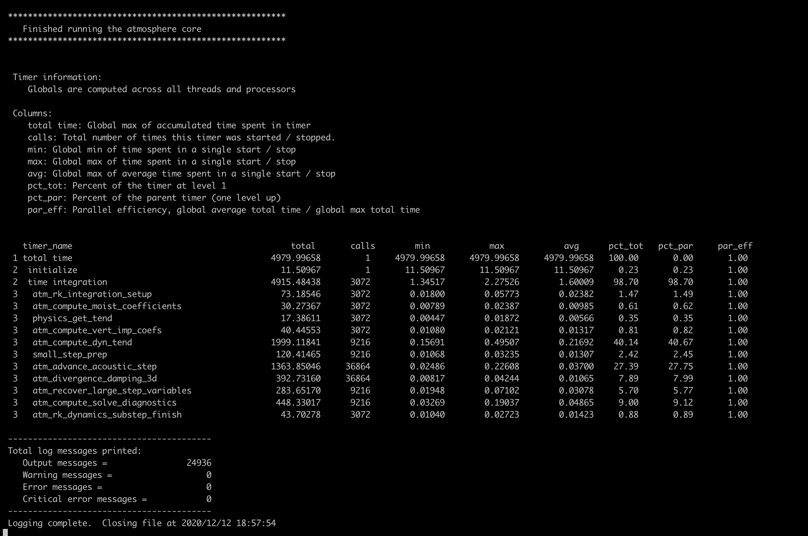
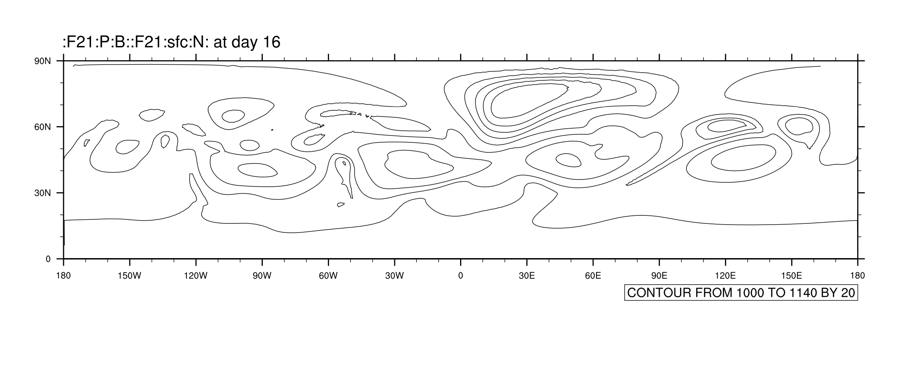

## Resources to learn about MPAS
I would start by going to https://mpas-dev.github.io/ and poking around, especially the links about the atmospheric model.

Then, you can skim through the tutorial here: http://www2.mmm.ucar.edu/projects/mpas/tutorial/Boulder2019/index.html <br /> 
File 4 in particular is very helpful for understanding the mesh structure.

I have uploaded a Google Drive folder with a bunch of PDFs I found helpful to understand things. The tutorial PDFs are also located there.
The link is https://drive.google.com/drive/folders/1d3mViA53ELeKhiph5kzJndGQwXw7zL_W?usp=sharing. <br />

The user guide is also very helpful (direct link: http://www2.mmm.ucar.edu/projects/mpas/mpas_atmosphere_users_guide_7.0.pdf). It is also in the google drive. Pages 65-69 are particularly useful for understanding the Voronoi mesh, as well as making sense of the variables in the mesh files. It might also provide some motivation for why we designed the data structures the way we did.

When you get to the stage where you want to understand the MPAS codebase, we have a google doc here: https://docs.google.com/document/d/1yF4sEZyL1xUkHHfx-uYcRANpZyboRIZo3iiaydksnlw/edit


## Getting set up on Sherlock

First, get Prof. Aiken to invite you to sherlock.

You can then log onto sherlock by doing ssh <sunetID>@login.sherlock.stanford.edu, and then typing in your Stanford password and 2FA. 

Sherlock is a cluster computer consisting of many nodes, which are just individual machines.  Sherlock is built using a "condo" model where owners buy nodes that are added to the cluster.  Owners have priority on their partitions (the nodes they own) and can also access other owners' nodes when they are not being used.  Sherlock is quite heterogeneous; different nodes have different processor capabilities and different amounts of memory.  The aaiken partition, to which you have access, has 4 nodes with GPUs and 4 nodes with CPUs only; we will be using the GPU nodes for this class.

When you login you will be on a head node, which is shared by multiple users. Don't do any significant computations on the head node, as that can affect other users.  You should only use the head node to allocate resources and run jobs on the compute nodes.  If you do try to run a Regent program on the head node it will fail because the particular build of Regent we are using assumes the presence of GPUs, which the head nodes do not have.

## Allocating A Compute Node

To allocate a compute node run the following command
```
salloc --gres gpu:1 --cpus-per-task 4 -p aaiken --time 1:00:00
```

This command requests the allocation of 1 GPU and 4 CPUs on a single node for one hour (which should be enough time for this assignment, but you can ask for more time if you need it).  Again, we need at least one GPU available to satisfy the particular build configuration of Regent, even though we won't use the GPU in this assignment.  The salloc command will immediately print something like
```
salloc: Pending job allocation 8436915
salloc: job 8436915 queued and waiting for resources
```

When the resources have been allocated to you (which may take a couple of minutes) you will see additional information along the lines of

```
salloc: job 8436915 has been allocated resources
salloc: Granted job allocation 8436915
```

The question now is: What node have you been allocated?  The salloc command doesn't say, so you need to run
```
squeue | grep <Your SUNet ID>
```
An example output from this command is
```
8436915 aaiken bash aaiken R 2:11 1 sh02-14n03
```

The name of the node you have been allocated is the last entry on this line, in this case sh02-14n03.  You can now ssh to that node.

Once you are on the node you are ready to run Regent.  The build we will be using is in
```
/home/groups/aaiken/eslaught/regent_build_cuda_2020-09-03/language
```

You may want to give this directory an alias, such as `$REGENT_HOME`, in your `.bash_profile` so that you don't need to type it every time you run Regent.

To run Regent programs, you will want to use the following syntax:

```
$REGENT_HOME/regent.py <file_name>.rg
```


## Running regent-mpas
In the top level directory, run 

```
$REGENT_HOME/regent.py main.rg
```
You have to run this in your `regent-mpas` folder, because we use relative paths to access some of the helper files.
 
Please also add the following to your `~/.bash_profile` so that terra knows where to look for the files we "require". You will need to edit some of the filepaths depending on how you saves mpas-regent - I have it in a file called regent_project_2020, for e.g. - you should remove that otherwise. 

```
export TERRA_PATH="$HOME/mpas-regent/mesh_loading/?.rg;$HOME/mpas-regent/dynamics/?.rg;$HOME/mpas-regent/?.rg;$HOME/mpas-regent/vertical_init/?.rg"
```

## Helpful tricks for working in Sherlock
You can avoid having to 2FA multiple times when logging into Sherlock by following the instructions here: 
https://www.sherlock.stanford.edu/docs/advanced-topics/connection/#avoiding-multiple-duo-prompts <br />


You can also edit files in Sherlock using VSCODE by doing something similar to this: 
https://www.youtube.com/watch?v=vpK4rXLc0WY&feature=youtu.be&ab_channel=RyanEberhardt <br />


## Installing MPAS 
Step 0: Follow the attached script [here](https://drive.google.com/file/d/1l9SuVG6McN817YEMmhxuQuyauPTs6xbP/view?usp=sharing) to install all dependencies. I did all of this locally. It might be easier to go through the steps one by one instead of running the whole script at once, I found that helped me find out where it was going wrong. There are some lines that will need to be changed (mostly around filepaths), I have made notes of that in the script. 

Step 1: Obtain Model source code 

```
git clone https://github.com/MPAS-Dev/MPAS-Model.git
cd MPAS-Model
```

Step 2: Compile MPAS init_atmosphere and atmosphere cores:
```
make -j4 gfortran CORE=init_atmosphere PRECISION=single USE_PIO2=true
make clean CORE=atmosphere
make -j4 gfortran CORE=atmosphere PRECISION=single USE_PIO2=true
```


Step 3: Download the idealized initial conditions: I used the Jablonowski and Williamson baroclinic wave, which is the same one we are trying to use in the Regent implementation

```
wget http://www2.mmm.ucar.edu/projects/mpas/test_cases/v7.0/jw_baroclinic_wave.tar.gz
tar xzvf jw_baroclinic_wave.tar.gz
cd jw_baroclinic_wave
```


Step 4: Link the previously compiled init_atmosphere core (from step 2) and run it:

```
ln -s ${HOME}/MPAS-Model/init_atmosphere_model .  (here, $HOME refers to your top level directory, you can see how I set it in the Dependencies script)
./init_atmosphere_model
```

In another terminal window, if you enter `tail -f log.init_atmosphere.0000.out` you can see its progress, and eventually you should get this output: 


Step 5: Link the previously compiled atmosphere core and run it:

```
ln -s ${HOME}/MPAS-Model/atmosphere_model .
./atmosphere_model
```

This might take a while, I think I went away for dinner for an hour and came back. Eventually, I had this output:


Step 6: Install ncl following the instructions [here](https://www.ncl.ucar.edu/Download/conda.shtml):
```
conda create -n ncl_stable -c conda-forge ncl
source activate ncl_stable
```

Step 7: Run the bwave_surface_p.ncl script to produce plots of surface pressure each simulated day. 
```
ncl bwave_surface_p.ncl
```
Here is the output from the final timesteps:




## Overview of project:

### Mesh loading
If you navigate to MPAS-Atmosphere -> MPAS-Atmosphere meshes, you will find some MPAS meshes. If you download them, you will see that they have a grid.nc file. This contains the mesh data in netcdf format. If you have netcdf installed (you can load it easily on Sherlock), you can manipulate these files and see their contents easy using ncdump. Syntax for ncdump can be found here: http://www.bic.mni.mcgill.ca/users/sean/Docs/netcdf/guide.txn_79.html#:~:text=The%20ncdump%20tool%20generates%20an,variable%20data%20in%20the%20file.&text=Thus%20ncdump%20and%20ncgen%20can,between%20binary%20and%20ASCII%20representations.

For example, you can do ncdump x1.2562.grid.nc >> output.txt to dump the contents of the grid file into a txt file called output.txt, and ncdump -v "latCell" to dump the contents of variable latCell.

We have converted these netcdf files into regent data structures. This was possible because there is a C library to manipulate netcdf files (I think this is the one: https://www.unidata.ucar.edu/software/netcdf/docs/getting_and_building_netcdf.html). Regent has support for calling C functions, so that is basically what we do to read the grid files into the data structures in mesh_loading.rg. Many of the C functions are wrapped in terra functions in netcdf_tasks.rg


### Partitioning
In the grid folder that you download, there is a .graph.info file. The graph.info files can be partitioned using a software called METIS.

If you'd like to partition the cells into N partitions, you run gpmetis graph.info N, which creates a file graph.info.part.N. 

This file has nCells rows, and each row has a number from 0-(N-1), which I assume to mean the partition that each cell is split into. 

I have a task called read_file in mesh_loading.rg that parses this graph.info file and returns an array where each element is the partition number of that cell index. We then assign this partition number to the cell and partition in regent based on this.

We also create halo regions around each partition.
partition_s_1 is the immediate ring around each partition, i.e. 10 neighbour cells
partition_s_2 is two rings around each partition, so it has the neighbours of all neighbours. I.e. 100 cells.

partition_halo_1 is just the inner halo, so partition_s_1 - cell_partition_initial
and partition_halo_2 is the outer halo, so partition_s2  - partition_halo_1 - cell_partition_initial

To understand the halo code, I would recommend reading the sections about images and preimages at http://regent-lang.org/reference/.  (And ask any questions that may come up, it's a little confusing).

You can also read about dependent partitioning here: https://drive.google.com/drive/u/1/folders/1d3mViA53ELeKhiph5kzJndGQwXw7zL_W

A significant TODO would be to find a better way to do dependent partitioning/haloes - because we require each of the 10^2 neighbours to be values in the cell region for dependent partitioning, our cell data structure has 100 fields which is very messy...
### 


## File by file overview

### main.rg
This is the overview files that calls all of our sub-tasks.

### data_structures.rg
This is the file in which we define our regions. We currently have 4 main regions - a cell region, an edge region, a vertex region, and a vertical region. We find that most variables either are parameterized by a cell, edge, or vertex, while a small number are only a property of the vertical level we are at (hence the need for the fourth region).

### constants.rg
We declare constants here for use in other file.

### mesh_loading/mesh_loading.rg
This file has the task to load the data from the netcdf grid file. 

task load_mesh: This loads the data from the netcdf grid file. You can change the grid name in constants.rg.

task partition_regions: This partitions the regions. It works correctly, however I still have not been able to return the partition objects.

task write_output: This writes an output file to test that we have read the file correctly. To be called just after load_mesh if verification is required.

task write_output_plotting: This writes an output file to test that we have read the file correctly. To be called after running timestep, etc.

### vertical_init.rg/init_atm_cases.rg
This initializes many variables needed before we run the RK timestep (including much of the vertical grid). We currently use the Jablonowski and Williamson baroclinic wave test case.

### mesh_loading/netcdf_tasks.rg
This is a helper file employed by mesh_loading.rg that has the terra wrapper tasks around the C/netcdf functions we use to read the grid file.

### dynamics/dynamics_tasks.rg
This is where the meat of our kernels are. 

### dynamics/rk_timestep.rg
This is the file that contains the logic for taking a time step.


## Plotting
We turn the mesh into a 'patch' using mpas_patches.py. 

The file mpas_patches.py is a helper script that is used to create a MatPlotLib ‘patch collection’ of each of the individual grid cells.

We then use matplotlib to plot the 'patch' object. Edits to 

The script can be run by doing: python mpas-plotting.py <netcdf output file> -v <variable>: e.g. python mpas_plot_pressure.py timestep_output.nc -v pressure_p.
  
The plot headers can be edited in mpas_plot_pressure.py - in general there is no need to touch mpas_patches.py.

More information on plotting with MPAS can be found at https://github.com/MiCurry/MPAS-Plotting (although this is not very comprehensive either).


